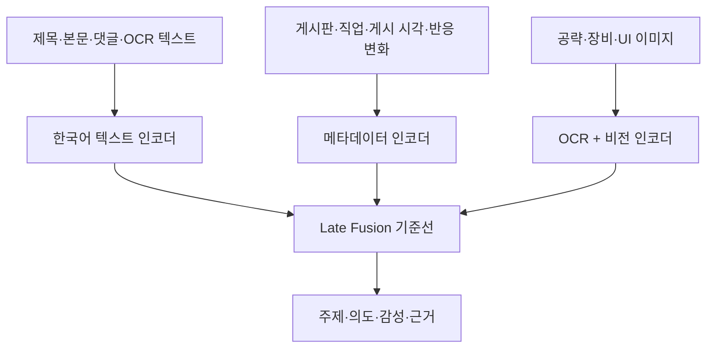

# MapleStory Community Listening

> 메이플스토리 커뮤니티의 게시글과 댓글을 수집·구조화하고, 게시판별 대화 목적에 맞춰
> 이슈와 반응을 관측하는 데이터 분석 포트폴리오입니다.

[](https://www.python.org/)
[](https://streamlit.io/)
[](#검증)

**[라이브 대시보드 보기](https://maplestory-community-listening-qrq5vrmunhgd9tpjq5drql.streamlit.app/)**


## 프로젝트 개요

라이브 서비스에서는 커뮤니티의 목소리가 빠르게 쌓이지만, 조회수나 댓글 수가 높은 글만
보면 무엇이 문제인지, 작성자의 입장과 댓글 반응이 어떻게 다른지 설명하기 어렵습니다.
이 프로젝트는 다음 질문에서 출발했습니다.

> 메이플스토리 유저가 무엇을 이야기하고 있으며, 어떤 불만·요구·토론이 커지고 있는지를
> 재현 가능한 데이터로 빠르게 확인할 수 있을까?

이를 위해 데이터 수집부터 검증, 본문·댓글 보강, 자연어 분석, 대시보드와 공개 배포까지
하나의 파이프라인으로 설계하고 구현했습니다. 단순한 인기 글 순위를 넘어 게시판 성격에
맞는 질문을 정의하고, 모든 분석 결과를 원문과 표본으로 되돌아갈 수 있게 구성했습니다.

### 현재 공개 데이터

| 구분 | 규모 |
|---|---:|
| 수집 기간 | 2025.08.20–2026.07.17 |
| 수집 게시물 | 2,179건 |
| 수집 댓글 수 | 6,886개 |
| 누적 조회 | 2,909,278회 |
| 분석 단위 | 51개 |
| 의미 분석 게시물 | 566건 |
| 의미 분석 댓글 | 3,981건 |
| 분석 모델 | `domain-lexicon-v1.1` |

수집 게시물 전체와 의미 분석 표본은 구분됩니다. 의미 분석은 최근 90일의 댓글·추천·조회
상위 게시물을 지표별로 선별한 뒤 중복을 제거해 수행합니다.

## 무엇을 분석했는가

게시판마다 이용 목적이 다르기 때문에 동일한 지표와 해석을 일괄 적용하지 않았습니다.

| 분석 영역 | 핵심 질문 | 주요 결과 |
|---|---|---|
| 직업 게시판 | 직업별 불만·요구·토론은 무엇인가? | 직업별 주제, 의도, 작성 글 감성, 댓글 반응, 근거 게시물 |
| 자유게시판 | 커뮤니티에서 크게 이야기되는 이슈는 무엇인가? | 주요 이슈 점유율, 작성 글과 댓글 반응의 차이 |
| 질문과 답변 | 반복되는 질문과 정보 공백은 무엇인가? | 질문 주제, 댓글 반응, 답변이 필요한 표본 |
| 팁과 노하우 | 어떤 정보와 공략이 주목받는가? | 정보 주제, 활용 반응, 원문 근거 |

조회·추천·댓글은 **관심이 큰 게시물을 선택하는 지표**로 사용합니다. 높은 조회수를 긍정
반응으로 간주하지 않으며, 작성 글 감성과 댓글 반응은 텍스트에서 각각 분리해 판단합니다.

## 시스템 설계

```mermaid
flowchart LR
    A["메이플 인벤 공개 게시판"] --> B["VPS 메타데이터 수집"]
    B --> C["PostgreSQL 누적 저장"]
    C --> D["체크섬 기반 Export Release"]
    D --> E["상위 표본 선별"]
    E --> F["본문·댓글 증분 수집"]
    F --> G["보안 검사·텍스트 정제"]
    G --> H["주제·의도·감성 추론"]
    H --> I["아티팩트 스키마·건수 검증"]
    I --> J["Streamlit 대시보드"]
    J --> K["Streamlit Community Cloud"]
```



### 핵심 설계 결정

1. **사실과 해석의 분리**  
   게시물 ID, 시각, 조회·추천·댓글 수는 검증된 ZIP에 저장하고, 본문·댓글과 모델 결과는
   ZIP 해시가 일치하는 별도 분석 아티팩트에 저장합니다.

2. **게시판별 분석 단위**  
   직업·자유게시판·질문과 답변·팁과 노하우를 독립된 분석 단위로 다룹니다. 직업 화면에는
   선택한 직업의 게시물만 들어가도록 게시판 ID와 직업 분류를 함께 검증합니다.

3. **재현 가능한 표본 선정**  
   최근 90일 기준으로 직업은 지표별 상위 5건, 일반 게시판은 지표별 상위 20건을 선택한
   뒤 `(board_id, post_id)`로 중복을 제거합니다. 선택 정책과 모델 버전을 manifest에
   기록합니다.

4. **증분 처리**  
   새 ZIP이 들어오면 해시가 바뀐 게시물만 상세 수집과 추론을 다시 수행합니다. 동일한
   데이터와 모델 버전은 재사용하므로 매번 전체 데이터를 다시 분석하지 않습니다.

5. **실패 폐쇄와 감사 가능성**  
   체크섬·스키마·건수 대사가 실패한 결과는 화면에 반영하지 않습니다. 프롬프트 인젝션
   의심 텍스트는 격리하며, 원문 대신 출처 ID와 해시 중심의 감사 기록을 남깁니다.

## 데이터 분석 과정

### 1. 수집

- APScheduler가 6시간 간격의 수집 슬롯을 생성합니다.
- 공개 게시판의 게시물 ID, 직업/게시판, 게시 시각, 조회·추천·댓글 수를 누적합니다.
- 동일 슬롯의 재실행은 저장된 실행 결과를 재사용해 중복 요청을 억제합니다.
- 중단된 과거 수집은 페이지 커서와 요청 예산을 저장해 이어서 처리합니다.

### 2. 검증과 내보내기

- PostgreSQL 스냅샷에서 하나의 원자적 Export Release를 생성합니다.
- ZIP 내부 파일별 SHA-256을 확인하고 예상 스키마와 중복 키를 검사합니다.
- 다운로드 중인 `.partial` 파일과 불완전한 릴리스는 대시보드가 선택하지 않습니다.

### 3. 표본 선정과 텍스트 보강

- 댓글·추천·조회 상위 글을 각각 선택해 한 지표에 편향되지 않게 구성합니다.
- 선별된 글의 본문과 공개 댓글을 수집하고 HTML, 프로필 정보, 작성자 식별정보를 제거합니다.
- 댓글 수 불일치와 파싱 실패는 기록하며 완전한 데이터처럼 취급하지 않습니다.

### 4. 자연어 처리

현재 실행 모델은 한국어 게임 도메인 사전 기반 기준선 `domain-lexicon-v1.1`입니다.

| 출력 | 분류 기준 |
|---|---|
| 주제 | 제목·본문에서 주제별 표현의 일치 횟수를 비교 |
| 작성 의도 | 불만·요구·토론·질문·칭찬·정보 표현을 비교 |
| 작성 글 감성 | 본문을 긍정·중립·부정·혼합으로 분류 |
| 댓글 반응 | 댓글별 감성을 계산한 뒤 중립을 제외한 최빈 범주 사용 |
| 근거 | 판정에 사용된 표현과 원문 게시물 링크 보존 |

사전 기반 모델의 한계를 감추지 않고 반어·은어·혼합 사례는 근거 게시물과 함께 검토하도록
설계했습니다. 향후 이중 라벨 골드셋이 확보되면 한국어 인코더를 미세조정하고, 시간 순
홀드아웃의 macro-F1과 calibration error를 기준선과 비교할 계획입니다.

### 5. 텍스트 멀티모달 확장

현재 모델은 제목·본문·댓글을 중심으로 동작합니다. 다음 단계에서는 첨부 이미지가 있는
공략·장비·오류 게시물에 OCR과 비전 표현을 결합합니다.



텍스트만, 텍스트+메타데이터, 텍스트+메타데이터+이미지를 차례로 비교해 각 모달리티가
실제로 성능 개선에 기여하는지 ablation study로 검증합니다.

## 대시보드 구성

- **프로젝트**: 문제 정의, 전체 데이터 규모, 분석 워크플로우, 직업 비교
- **직업 분석**: 직업별 게시물·댓글·추천·조회와 불만·요구·토론 주제
- **자유게시판**: 주요 이슈와 작성 글–댓글 반응 분포
- **질문과 답변**: 댓글이 없는 질문, 반복 질문과 반응
- **팁과 노하우**: 인기 정보·공략 주제와 활용 반응
- **NLP·멀티모달**: 분류 기준, 모델 역할, 평가·갱신 전략
- **수집 상태**: 체크섬, 실행 이력, 최신 관측 시각

각 표와 차트에는 분석 기간, 표본 수, 모델 버전과 원문 링크를 함께 제공합니다.

## 사용 기술과 선택 이유

| 영역 | 기술 | 사용 목적 |
|---|---|---|
| 언어·환경 | Python 3.12, uv | 재현 가능한 의존성 및 실행 환경 |
| 수집 | HTTPX, BeautifulSoup, lxml, Playwright | 공개 게시판의 메타데이터와 상세 텍스트 수집 |
| 스케줄링 | APScheduler | 6시간 수집 슬롯과 재실행 관리 |
| 데이터베이스 | PostgreSQL 16, SQLAlchemy, Alembic | 누적 스냅샷, 실행 상태, 스키마 버전 관리 |
| 분석 | pandas, NumPy, scikit-learn, YAML 규칙 | 표본 선정, 집계, 기준선 모델과 설정 버전 관리 |
| 멀티모달 준비 | Pillow, Tesseract OCR | 이미지 텍스트 추출과 후속 비전 모델 입력 |
| 대시보드 | Streamlit, Altair | 상호작용형 탐색, 표·차트와 원문 근거 연결 |
| 배포 | Docker Compose, Streamlit Community Cloud | 수집기와 공개 포트폴리오 실행 환경 분리 |
| 품질 | pytest, Ruff, respx | 단위·대시보드·HTTP 경계 테스트와 코드 품질 검사 |
| 보안 | SHA-256, allowlist, quarantine | 릴리스 무결성 및 비신뢰 텍스트 격리 |

## 프로젝트 구조

```text
src/maple_monitor/
├── collection/        # 게시판 수집, 파싱, 증분·백필 처리
├── dashboard/         # Streamlit 페이지, 차트, 표시용 분석
├── local/             # 본문·댓글 보강과 의미 분석 아티팩트
├── ops/               # 스케줄러, 실행 제어, 상태 점검
├── ranking/           # 누적 순위 계산
└── security/          # 비신뢰 텍스트 검사와 격리

config/                # 수집·분석 규칙
alembic/               # 데이터베이스 마이그레이션
portfolio_data/        # 공개 대시보드용 검증 스냅샷
scripts/               # 다운로드, 실행, 배포 보조 명령
tests/                 # unit, dashboard, integration 테스트
docs/                  # 설계 결정, 운영 절차, 검증 기록
```

## 로컬 실행

### 준비

```powershell
git clone https://github.com/seokbeomkong/maplestory-community-listening.git
Set-Location maplestory-community-listening
uv sync --locked
```

### 공개 스냅샷으로 대시보드 실행

```powershell
$env:MAPLE_EXPORT_PATH = "portfolio_data"
$env:MAPLE_ANALYSIS_ROOT = "portfolio_data\analysis"
uv run streamlit run src\maple_monitor\dashboard\export_app.py
```

브라우저에서 `http://localhost:8501`을 열면 됩니다.

### 새 Export Release 분석

```powershell
uv run maple-monitor analyze-export `
  --export-path "C:\path\to\exports" `
  --analysis-root "C:\path\to\exports\analysis"
```

같은 ZIP digest와 모델 버전은 재사용하고 변경된 표본만 증분 처리합니다.

## 검증

```powershell
uv run pytest tests\unit tests\dashboard -q
uv run ruff check src tests
```

현재 공개 릴리스 기준으로 단위·대시보드 테스트 **450개**가 통과했습니다. 테스트는 다음을
포함합니다.

- 게시판/직업 분석 범위의 일치 여부
- 체크섬과 ZIP 스키마 검증
- 표본 선정의 결정성 및 중복 제거
- 본문·댓글 파싱과 감성·의도·주제 분류
- 기간·표본 수·소수점 표시 형식
- 비신뢰 텍스트 격리와 분석 제외
- Streamlit 페이지의 근거·빈 상태·포트폴리오 문구

PostgreSQL 통합 테스트는 격리된 테스트 데이터베이스가 명시된 경우에만 실행되도록
fail-closed로 구성했습니다.

## 제가 구현하며 보여주고자 한 역량

- 제품 질문을 게시판별 분석 요구사항과 데이터 계약으로 전환하는 능력
- 수집, 저장, 분석, 시각화, 배포를 연결하는 end-to-end 데이터 엔지니어링
- 주제·의도·감성과 관심 지표를 구분하는 NLP 문제 설계
- 해시·모델·정책 버전을 남기는 재현 가능한 분석 파이프라인
- 오류와 불완전한 데이터를 숨기지 않는 데이터 품질 및 보안 설계
- 채용 담당자가 링크 하나로 탐색할 수 있는 인터랙티브 포트폴리오 구현

## 한계와 다음 단계

- 현재 감성 모델은 사전 기반 기준선이므로 반어, 신조어, 문맥 의존 표현에 한계가 있습니다.
- 상위 반응 표본은 중요한 이슈 탐지에 유리하지만 커뮤니티 전체 여론의 확률 표본은 아닙니다.
- 이미지 분석은 설계와 입력 경로까지 정의했으며 충분한 이미지 표본과 라벨 확보 후 평가합니다.
- 모델 교체는 정확도 하나가 아니라 macro-F1, 라벨별 오류, 확률 보정과 시간 변화 안정성을
  함께 검증한 뒤 결정합니다.

## 링크

- **라이브 대시보드**: https://maplestory-community-listening-qrq5vrmunhgd9tpjq5drql.streamlit.app/
- **GitHub 저장소**: https://github.com/seokbeomkong/maplestory-community-listening
- **공식 비주얼 출처**: https://maplestory.nexon.com/promotion/event/2026/20260618/event01

---

이 저장소는 개인 데이터 분석 포트폴리오입니다. MapleStory 및 관련 공식 이미지의 저작권과
상표권은 NEXON Korea에 있으며, 커뮤니티 원문은 각 작성자와 원 출처에 귀속됩니다.
