# Maple Inven Monitoring and Analysis Design

## 1. Purpose

Build a private, continuously updated analytics system for MapleStory Inven. The system collects public post metadata from job, free, and information-sharing boards, selects high-engagement posts over a rolling 90-day window, then analyzes their bodies, comments, and media.

The system runs once per day on a Hostinger KVM 2 VPS and exposes a Streamlit dashboard only through Tailscale. It exports normalized CSV files for independent analysis.

## 2. Goals

- Compare concerns, satisfaction, requests, and controversies across 48 playable jobs.
- Identify current interests in the free board and three information-sharing boards.
- Distinguish what authors say from how commenters react.
- Preserve daily engagement rankings and rank-entry history.
- Handle posts whose meaningful discussion is primarily in comments.
- Extract useful text and context from images, GIFs, and videos without retaining full media indefinitely.
- Keep routine crawling independent of Codex so daily collection consumes no Codex tokens.
- Fit reliably within 2 vCPU, 8 GB RAM, 100 GB NVMe, and 8 TB bandwidth.

## 3. Non-goals

- Logging in to Inven or accessing non-public content.
- Bypassing CAPTCHA, paywalls, authentication, or explicit access controls.
- Republishing full posts, comments, images, or videos.
- Permanently storing author nicknames or exposing them in the dashboard.
- Running a large local language model on the KVM 2 VPS.
- Collecting every post body and every comment before engagement filtering.

## 4. Confirmed Decisions

| Area | Decision |
| --- | --- |
| Operating model | Persistent monitoring |
| Schedule | Once per day, Korea Standard Time |
| Ranking window | Rolling 90 days |
| Initial backfill | 90 days |
| Output | Private Streamlit dashboard plus CSV |
| Hosting | Hostinger KVM 2 VPS |
| Access | Tailscale-only private access |
| Storage | PostgreSQL |
| Deployment | Docker Compose |
| Text analysis | Hybrid local processing plus selective LLM analysis |
| Blocked-page fallback | Pinned `insane-search` engine, then local browser fallback |
| Ranking rule | Separate top 50 by views, recommendations, and comments; analyze the de-duplicated union |

## 5. Source Scope

### 5.1 Job boards

The collector crawls five board streams and derives job membership from each post's category. It does not request every job filter separately.

| Job group | Board ID | Included jobs |
| --- | ---: | --- |
| Warrior | 2294 | Hero, Paladin, Dark Knight, Dawn Warrior, Aran, Demon Slayer, Mihile, Kaiser, Demon Avenger, Zero, Blaster, Adele, Ren |
| Magician | 2295 | Arch Mage (Fire/Poison), Arch Mage (Ice/Lightning), Bishop, Blaze Wizard, Evan, Battle Mage, Luminous, Kinesis, Illium, Lara, Lete |
| Bowman | 2296 | Bowmaster, Marksman, Wind Archer, Wild Hunter, Mercedes, Pathfinder, Kain |
| Thief | 2297 | Night Lord, Shadower, Night Walker, Dual Blade, Phantom, Cadena, Hoyoung, Khali |
| Pirate | 2298 | Mechanic, Buccaneer, Corsair, Thunder Breaker, Cannoneer, Angelic Buster, Xenon, Shade, Ark |

There are 48 included jobs. Every job-group `Tips/Info` category is excluded. Pink Bean and Yeti are excluded.

The database stores the Korean source category verbatim and maps it to a stable internal job identifier. The source category remains authoritative if labels change.

### 5.2 Free board

- Main board: 5974
- All ordinary categories are included.
- Membership in `10 recommendations`, `30 recommendations`, and `30 recommendations verified` is stored as an observation flag.
- Sticky notices and advertisements are collected for auditability but excluded from top-50 ranking.

### 5.3 Information-sharing boards

The three independent boards are included:

| Board | Board ID |
| --- | ---: |
| Real-time news | 2314 |
| Tips and know-how | 2304 |
| User reporters | 2316 |

The editorial news collection and the certified-post aggregation page are excluded because their schemas and duplication behavior differ from independent community boards.

## 6. Analysis Units and Ranking

There are 52 independent analysis units:

- 48 jobs
- 1 free board
- 3 information-sharing boards

For each unit, the system ranks eligible posts published in the latest 90 days by:

1. view count
2. recommendation count
3. comment count

Each ranking selects 50 posts. Ties are resolved by metric descending, publication time descending, and post ID descending. If a unit has fewer than 50 eligible posts, all eligible posts are selected.

The three top-50 sets are unioned by `(board_id, post_id)`. Each ranking membership and rank is retained even though a post's details are fetched only once. A unit therefore has between 50 and 150 deep-analysis posts.

Daily observations preserve when a post enters, remains in, or exits a ranking.

## 7. Collection Architecture

```mermaid
flowchart LR
    A[System scheduler] --> B[List metadata collector]
    B --> C[Metadata staging]
    C --> D[90-day ranking in PostgreSQL]
    D --> E[Deep-fetch queue]
    E --> F[Ordinary HTTP fetch]
    F -->|invalid or blocked| G[insane-search fallback]
    G -->|JavaScript required| H[Local browser fallback]
    F --> I[Body, comments, and media parser]
    G --> I
    H --> I
    I --> J[Normalized PostgreSQL tables]
    J --> K[Local analysis]
    K -->|uncertain or representative cases| L[Optional LLM analysis]
    K --> M[Streamlit dashboard]
    L --> M
    J --> N[CSV exports]
```

### 7.1 Services

Docker Compose separates the following services:

- `collector`: list, detail, comment, and media collection
- `analyzer`: local NLP, media extraction, and selective LLM calls
- `postgres`: metadata, observations, content, and analysis results
- `dashboard`: Streamlit application and CSV export
- `scheduler`: daily, weekly, and monthly jobs

Tailscale runs on the VPS host. PostgreSQL and Streamlit are not exposed to the public internet.

## 8. Token and Runtime Optimization

### 8.1 Codex usage boundary

Codex is used only to build, test, change, and diagnose the software. Routine crawling is performed by ordinary Python and browser processes on the VPS. The daily scheduler does not start a Codex task, Codex CLI session, or Codex automation.

Consequently:

- metadata collection consumes zero Codex tokens
- deterministic HTML parsing consumes zero Codex tokens
- ranking SQL, CSV generation, and dashboard rendering consume zero Codex tokens
- `insane-search` is called as a pinned Python engine, not as an agent conversation
- local Playwright or Patchright handles browser fallback without asking Codex to read pages

If an OpenAI API model is used for selective analysis, that usage is separately budgeted API activity and is not routine Codex usage.

### 8.2 Two-pass collection

The first pass fetches only list pages and stores:

- board and category
- post ID and URL
- title
- publication date
- views
- recommendations
- comment count
- notice and advertisement flags
- image, video, and attachment indicators
- free-board recommendation-feed membership

Only the de-duplicated ranking union enters the second pass for body, complete comments, and media-derived text.

### 8.3 Incremental refresh tiers

- Daily: new list pages, posts aged 0-7 days, active ranking members, and near-cutoff candidates
- Weekly: posts aged 8-30 days
- Monthly: posts aged 31-90 days
- Free-board recommendation feeds: daily, to detect late popularity spikes

The collector stops list pagination as soon as it reaches the last known post during incremental runs or passes the 90-day cutoff during backfill.

Content hashes prevent unchanged bodies and comments from being parsed or analyzed again. Model outputs are cached by `(content_hash, analysis_version)`.

### 8.4 Local-first analysis budget

Local processing handles:

- HTML cleaning and quoted-text removal
- Korean normalization and slang dictionary matching
- sentence embeddings and topic clustering
- duplicate and near-duplicate detection
- OCR
- engagement calculations
- representative-comment selection

LLM analysis is limited to:

- ambiguous sentiment, sarcasm, or mixed stance
- low-confidence topic assignments
- representative cluster summaries
- selected media descriptions when OCR is insufficient

The analyzer enforces configurable daily limits for analyzed posts, input tokens, output tokens, retries, and total spend. Unchanged content is never resubmitted.

For long comment threads, the LLM receives de-identified cluster representatives, high-reaction comments, disagreement examples, and local aggregate counts rather than the full raw thread.

## 9. Fetching and Rate Control

The collector uses a validation-based escalation chain:

1. ordinary HTTP request
2. pinned `insane-search` Python engine when the response is blocked or structurally incomplete
3. local browser when public content requires JavaScript

HTTP 200 is not sufficient. A response must contain expected list, article, or comment selectors and plausible content size.

The global request rate is conservative, uses randomized delay, and defaults to one active request. A second worker may be enabled only after observed success without rate limiting. HTTP 429 pauses that board and applies exponential backoff. CAPTCHA, authentication, paywall, and explicit access denial are terminal conditions for that run.

Every run is idempotent and stores page-level checkpoints. A partial run resumes from the last completed page.

## 10. Detail and Comment Collection

Deep-selected posts store:

- title and category
- publication and modification observations
- cleaned body text and content hash
- daily views, recommendations, and comment count
- deletion, hiding, and access state
- complete comment hierarchy
- comment text, time, author pseudonym, author-is-post-writer flag, likes, and dislikes

Inven initially exposes comments in batches for long threads. The parser loads every public 100-comment segment and verifies that the number of unique comment IDs matches the displayed comment count. Missing segments produce an incomplete status rather than a false success.

A post receives `comment_led = true` when its cleaned body is 50 characters or fewer or when comments contain at least 80% of the analyzable text and at least three comments exist. Both the Boolean result and the rule version are stored.

Nicknames are replaced by salted pseudonymous hashes. Raw nicknames are not included in CSV or the dashboard.

## 11. Media Handling

Media processing occurs only for deep-selected posts.

### Images

- store source URL, dimensions, media type, and content hash
- run local OCR
- generate a concise visual description only when needed
- compute a perceptual hash for duplicate memes and screenshots
- retain only a small preview for 30 days
- retain OCR, derived description, and hashes long-term

### GIFs

- sample 3-5 representative frames
- run OCR and visual description on sampled frames
- do not retain the full animation long-term

### Videos

- store platform, video ID, URL, title, and duration when public
- obtain public captions or transcripts when available
- if captions are unavailable, sample a small number of representative frames
- do not retain the full video

### Attachments

- store filename, extension, reported size, URL, and hash when safely retrievable
- never execute attachments
- mark unsupported or inaccessible attachments without failing the post

## 12. Data Model

| Table | Purpose |
| --- | --- |
| `boards` | Source board definitions |
| `jobs` | Stable job and job-group mappings |
| `posts` | Canonical post identity and current state |
| `post_versions` | Body and title change history |
| `post_metrics_daily` | Daily views, recommendations, and comment counts |
| `ranking_observations` | Metric, unit, rank, and observation date |
| `feed_observations` | Free-board recommendation-feed membership |
| `comments` | Canonical comments and reply hierarchy |
| `comment_metrics` | Comment likes and dislikes over time |
| `media_assets` | Media metadata and derived analysis |
| `analysis_labels` | Topic, sentiment, emotion, target, stance, confidence, and model version |
| `collection_runs` | Run status and aggregate diagnostics |
| `collection_pages` | Page checkpoints, validation, retry, and error state |

Source HTML is compressed and retained for 30 days for parser diagnostics. Normalized text and observations are retained long-term.

## 13. Analysis Method

Post bodies and comments are analyzed separately.

### Labels

- Topics: balance, skill mechanics, bugs, hunting, bosses, growth, equipment, economy, convenience, updates, operations, and community
- Sentiment: positive, neutral, negative
- Emotion: satisfaction, expectation, complaint, anger, concern, ridicule, request, confusion
- Target: job, skill, game system, operator, or other players
- Reaction: agreement, disagreement, added information, question, joke, or conflict
- Information type: guide, test, numerical evidence, patch information, or opinion

### Derived measures

- views per day
- comments per 1,000 views
- recommendations per 1,000 views
- engagement relative to the unit median
- days present in each top-50 ranking
- comment sentiment distribution
- body-versus-comment sentiment gap
- controversy score
- comment-led post rate

Raw engagement and age-normalized engagement are displayed together so older posts do not dominate interpretation without context.

## 14. Dashboard

The Tailscale-only Streamlit dashboard contains:

- overall themes across 48 jobs and four non-job units
- job comparison heatmap
- job detail with the three top-50 lists and representative discussions
- issue diffusion from job boards into the free board
- comment-led, agreement, disagreement, and controversy views
- media-derived OCR, transcript, and topic views
- 7-day, 30-day, and 90-day comparisons
- collection freshness, failures, missing comments, and retries
- filtered CSV exports

Reader-facing excerpts remain short and link to the source page. Full source posts and media are not republished.

## 15. CSV Outputs

- `posts.csv`
- `post_metrics_daily.csv`
- `ranking_observations.csv`
- `comments.csv`
- `media_analysis.csv`
- `analysis_labels.csv`
- `topic_daily.csv`
- `maple_monitor_export.csv`, a denormalized analysis-friendly export

All CSV files are UTF-8 with a BOM when intended for direct Korean Excel use. Dates use ISO 8601 and numeric metrics remain numeric.

## 16. Security and Privacy

- Dashboard and database ports are blocked from the public internet.
- Tailscale ACLs permit only approved devices and users.
- SSH administration is restricted to Tailscale where operationally possible.
- Secrets live in environment files excluded from Git and use least privilege.
- LLM input removes nicknames and unnecessary profile information.
- Raw HTML and previews have bounded retention.
- Database backups are encrypted or stored in an access-controlled location.

## 17. Error Handling

- Parser validation rejects structurally empty or challenge pages.
- Schema drift quarantines source HTML instead of writing misleading blanks.
- Body, comments, and media fail independently.
- Comment count mismatches remain visibly incomplete.
- Deleted and edited posts create state history rather than destructive overwrite.
- HTTP retries use bounded exponential backoff and jitter.
- Collection and analysis queues support safe replay.
- Daily run summaries report partial success by board and job.

## 18. Backup and Retention

- Daily compressed PostgreSQL backup
- Seven daily backups retained
- Three monthly backups retained
- Hostinger weekly backup retained as an infrastructure-level fallback
- Raw HTML retained 30 days
- Media previews retained 30 days
- Normalized text, hashes, metrics, rankings, and analysis retained long-term
- Disk alerts at 70% and 85%

## 19. Verification and Acceptance Criteria

- All 48 included jobs map correctly from live categories.
- Every `Tips/Info` category, Pink Bean, and Yeti is excluded from ranking.
- Notices and advertisements do not enter top-50 rankings.
- Representative list-page metrics match source pages.
- Rankings are deterministic and match independent fixture calculations.
- A post present in multiple rankings is deep-fetched once.
- Threads above 100 comments load all public segments and replies.
- Empty-body, comment-led, deleted, image-only, GIF, video-only, and inaccessible-media fixtures pass.
- Daily data freshness remains within 30 hours.
- Deep-selected body and comment completeness reaches at least 98%, excluding terminally unavailable sources.
- Normal operation remains below 6 GB RAM on KVM 2.
- Daily collection can run with LLM disabled and with zero Codex usage.
- Formula and aggregation checks reconcile dashboard totals with PostgreSQL queries.

## 20. Rollout

1. Build parsers and fixtures for one job group, the free board, and one information board.
2. Validate metadata fields, 100-comment loading, and ranking on a bounded sample.
3. Enable all five job groups and three information boards.
4. Run the 90-day metadata backfill in resumable batches.
5. Calculate rankings and deep-fetch the de-duplicated union.
6. Enable local NLP with LLM disabled.
7. Validate dashboard and CSV against source samples.
8. Enable limited LLM analysis with explicit daily budgets.
9. Enable the daily scheduler and review the first seven runs.

The initial backfill is intentionally governed by site-friendly rate limits, so elapsed time is secondary to completeness and respectful access. It runs as an ordinary VPS process and does not consume Codex tokens while unattended.
