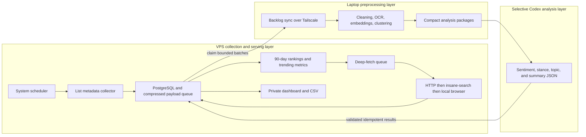

# Maple Inven Monitoring and Analysis Design

## 1. Purpose

Build a private, continuously updated analytics system for MapleStory Inven. The system collects public post metadata from job, free, and information-sharing boards, selects high-engagement posts over a rolling 90-day window, then analyzes their bodies, comments, and media.

The system runs once per day on a Hostinger KVM 2 VPS and exposes a Streamlit dashboard only through Tailscale. It exports normalized CSV files for independent analysis.

## 2. Goals

- Compare concerns, satisfaction, requests, and controversies across 48 playable jobs.
- Identify current interests in the free board and three information-sharing boards.
- Distinguish what authors say from how commenters react.
- Preserve daily engagement rankings and rank-entry history.
- Handle posts whose meaningful discussion is primarily in comments.
- Extract useful text and context from images, GIFs, and videos without retaining full media indefinitely.
- Keep routine crawling independent of Codex so daily collection consumes no Codex tokens.
- Fit reliably within 2 vCPU, 8 GB RAM, 100 GB NVMe, and 8 TB bandwidth.
- Continue collecting safely while the local analysis laptop is offline, then process the accumulated backlog when it reconnects.
- Present 24-hour, 7-day, and 30-day public-opinion trends that are useful to a MapleStory product or community team.
- Recover from process crashes and next-day reruns without duplicate posts, comments, observations, or analysis results.

## 3. Non-goals

- Logging in to Inven or accessing non-public content.
- Bypassing CAPTCHA, paywalls, authentication, or explicit access controls.
- Republishing full posts, comments, images, or videos.
- Permanently storing author nicknames or exposing them in the dashboard.
- Running a large local language model on the KVM 2 VPS.
- Collecting every post body and every comment before engagement filtering.

## 4. Confirmed Decisions

| Area | Decision |
| --- | --- |
| Operating model | Persistent monitoring |
| Schedule | Once per day, Korea Standard Time |
| Ranking window | Rolling 90 days |
| Initial backfill | 90 days |
| Output | Private Streamlit dashboard plus CSV |
| Hosting | Hostinger KVM 2 VPS |
| Access | Tailscale-only private access |
| Storage | PostgreSQL |
| Deployment | Docker Compose |
| Processing topology | VPS collection, local preprocessing, selective Codex analysis, results returned to VPS |
| Text analysis | Hybrid local processing plus selective Codex analysis |
| Blocked-page fallback | Pinned `insane-search` engine, then local browser fallback |
| Ranking rule | Separate top 50 by views, recommendations, and comments; analyze the de-duplicated union |
| Trending weights | Recommendations 50%, comments 35%, views 15%; configurable |
| Hot-data retention | Full analyzable content for 90 days; compact metadata and aggregates thereafter |

## 5. Source Scope

### 5.1 Job boards

The collector crawls five board streams and derives job membership from each post's category. It does not request every job filter separately.

| Job group | Board ID | Included jobs |
| --- | ---: | --- |
| Warrior | 2294 | Hero, Paladin, Dark Knight, Dawn Warrior, Aran, Demon Slayer, Mihile, Kaiser, Demon Avenger, Zero, Blaster, Adele, Ren |
| Magician | 2295 | Arch Mage (Fire/Poison), Arch Mage (Ice/Lightning), Bishop, Blaze Wizard, Evan, Battle Mage, Luminous, Kinesis, Illium, Lara, Lete |
| Bowman | 2296 | Bowmaster, Marksman, Wind Archer, Wild Hunter, Mercedes, Pathfinder, Kain |
| Thief | 2297 | Night Lord, Shadower, Night Walker, Dual Blade, Phantom, Cadena, Hoyoung, Khali |
| Pirate | 2298 | Mechanic, Buccaneer, Corsair, Thunder Breaker, Cannoneer, Angelic Buster, Xenon, Shade, Ark |

There are 48 included jobs. Every job-group `Tips/Info` category is excluded. Pink Bean and Yeti are excluded.

The database stores the Korean source category verbatim and maps it to a stable internal job identifier. The source category remains authoritative if labels change.

### 5.2 Free board

- Main board: 5974
- All ordinary categories are included.
- Membership in `10 recommendations`, `30 recommendations`, and `30 recommendations verified` is stored as an observation flag.
- Sticky notices and advertisements are collected for auditability but excluded from top-50 ranking.

### 5.3 Information-sharing boards

The three independent boards are included:

| Board | Board ID |
| --- | ---: |
| Real-time news | 2314 |
| Tips and know-how | 2304 |
| User reporters | 2316 |

The editorial news collection and the certified-post aggregation page are excluded because their schemas and duplication behavior differ from independent community boards.

## 6. Analysis Units and Ranking

There are 52 independent analysis units:

- 48 jobs
- 1 free board
- 3 information-sharing boards

For each unit, the system ranks eligible posts published in the latest 90 days by:

1. view count
2. recommendation count
3. comment count

Each ranking selects 50 posts. Ties are resolved by metric descending, publication time descending, and post ID descending. If a unit has fewer than 50 eligible posts, all eligible posts are selected.

The three top-50 sets are unioned by `(board_id, post_id)`. Each ranking membership and rank is retained even though a post's details are fetched only once. A unit therefore has between 50 and 150 deep-analysis posts.

Daily observations preserve when a post enters, remains in, or exits a ranking.

## 7. Collection Architecture



The layers are asynchronous. The VPS never waits for the laptop in order to collect. When the laptop is offline, compressed processing tasks accumulate in PostgreSQL and bounded payload storage. When the laptop reconnects through Tailscale, it claims the oldest eligible batches, processes them, optionally sends compact uncertain cases to Codex, validates the structured results, and returns them to the VPS.

The dashboard continues to show current metadata and engagement trends while local analysis is behind. Sentiment and topic panels display an explicit `analysis_fresh_through` timestamp and backlog count so stale analysis cannot be mistaken for current opinion.

### 7.1 Services

The VPS Docker Compose stack separates the following services:

- `collector`: list, detail, comment, and media collection
- `queue-api`: Tailscale-only batch claim, payload download, result upload, and acknowledgement
- `postgres`: metadata, observations, content, and analysis results
- `dashboard`: Streamlit application and CSV export
- `scheduler`: daily, weekly, and monthly jobs

Tailscale runs on the VPS host. PostgreSQL and Streamlit are not exposed to the public internet.

The Windows laptop runs a separate local worker outside the VPS stack. Windows Task Scheduler starts it at sign-in and retries periodically while the laptop is on. It processes fixed-size batches into a local DuckDB or Parquet cache, calls Codex only for bounded uncertain cases, and uploads validated results. Closing the laptop interrupts only a leased local batch; the lease expires and the same batch can be reclaimed safely later.

### 7.2 Resource boundaries

The VPS performs only network collection, minimal deterministic parsing, durable storage, ranking and trend calculation, and private dashboard serving. OCR, embeddings, topic clustering, large text transforms, and Codex calls never run on the VPS.

Default KVM 2 operating limits are:

- one active collection worker and one browser context at a time
- collector target of 1 vCPU and 512 MB RAM, with a hard memory limit of 1 GB
- browser fallback hard memory limit of 1.5 GB and automatic restart after a bounded number of pages
- PostgreSQL target of 1.5 GB RAM or less, including a 256-384 MB shared-buffer range
- dashboard and queue API combined hard memory limit of 768 MB
- at least 2 GB reserved for the operating system, Tailscale, backup, and temporary spikes

The VPS application stack has a 5.5 GB normal-operation guardrail. The limits are deployment defaults and are verified under real load before enabling the full backfill. PostgreSQL tables with time-series data use monthly partitions, compressed payloads, narrow indexes, and scheduled vacuum/analyze. The collector pauses deep media work when memory, disk, or load thresholds are exceeded; list metadata collection has priority.

The local worker claims 50-100 oldest eligible posts per batch over the Tailscale-only queue API. It acknowledges a batch only after local output passes schema validation and the VPS commits the results. If the laptop is off, collection and metadata trends remain current while the processing backlog grows within the retention limits.

## 8. Token and Runtime Optimization

### 8.1 Codex usage boundary

Routine crawling is performed by ordinary Python and browser processes on the VPS. The daily scheduler does not start a Codex task, Codex CLI session, or Codex automation. Codex is used on the laptop for software work and bounded text-analysis batches only when the laptop is on.

Consequently:

- metadata collection consumes zero Codex tokens
- deterministic HTML parsing consumes zero Codex tokens
- ranking SQL, CSV generation, and dashboard rendering consume zero Codex tokens
- `insane-search` is called as a pinned Python engine, not as an agent conversation
- VPS-local Playwright or Patchright handles browser fallback without asking Codex to read pages
- the dashboard and collection layers remain operational when Codex and the laptop are unavailable

Codex analysis consumes Codex usage only for the compact cases deliberately submitted from the laptop. Collection never submits raw HTML or one prompt per page. A future OpenAI API integration, if selected separately, would use its own explicit budget and is not required by this design.

### 8.2 Two-pass collection

The first pass fetches only list pages and stores:

- board and category
- post ID and URL
- title
- publication date
- views
- recommendations
- comment count
- notice and advertisement flags
- image, video, and attachment indicators
- free-board recommendation-feed membership

Only the de-duplicated ranking union enters the second pass for body, complete comments, and media-derived text.

### 8.3 Incremental refresh tiers

- Daily: new list pages, posts aged 0-7 days, active ranking members, and near-cutoff candidates
- Weekly: posts aged 8-30 days
- Monthly: posts aged 31-90 days
- Free-board recommendation feeds: daily, to detect late popularity spikes

The collector stops list pagination as soon as it reaches the last known post during incremental runs or passes the 90-day cutoff during backfill.

Content hashes prevent unchanged bodies and comments from being parsed or analyzed again. Model outputs are cached by `(content_hash, analysis_version)`.

### 8.4 Local-first analysis budget

Laptop-local processing handles:

- HTML cleaning and quoted-text removal
- Korean normalization and slang dictionary matching
- sentence embeddings and topic clustering
- duplicate and near-duplicate detection
- OCR
- engagement calculations
- representative-comment selection

Codex analysis is limited to:

- ambiguous sentiment, sarcasm, or mixed stance
- low-confidence topic assignments
- representative cluster summaries
- selected media descriptions when OCR is insufficient

The local worker enforces configurable per-session limits for analyzed posts, input tokens, output tokens, and retries. Unchanged content is never resubmitted. Analysis identity is `(content_hash, preprocessing_version, prompt_version, model_version)`, making cached results reusable and duplicate submissions detectable.

For long comment threads, Codex receives de-identified cluster representatives, high-reaction comments, disagreement examples, and local aggregate counts rather than the full raw thread. Input is compact JSONL and output must pass a versioned JSON Schema before upload. Only invalid records are retried.

## 9. Fetching and Rate Control

The collector uses a validation-based escalation chain:

1. ordinary HTTP request
2. pinned `insane-search` Python engine when the response is blocked or structurally incomplete
3. local browser when public content requires JavaScript

HTTP 200 is not sufficient. A response must contain expected list, article, or comment selectors and plausible content size.

The global request rate is conservative, uses randomized delay, and defaults to one active request. A second worker may be enabled only after observed success without rate limiting. HTTP 429 pauses that board and applies exponential backoff. CAPTCHA, authentication, paywall, and explicit access denial are terminal conditions for that run.

Every run is idempotent and stores page-level checkpoints. A partial run resumes from the last completed page.

## 10. Detail and Comment Collection

Deep-selected posts store:

- title and category
- publication and modification observations
- cleaned body text and content hash
- daily views, recommendations, and comment count
- deletion, hiding, and access state
- complete comment hierarchy
- comment text, time, author pseudonym, author-is-post-writer flag, likes, and dislikes

Inven initially exposes comments in batches for long threads. The parser loads every public 100-comment segment and verifies that the number of unique comment IDs matches the displayed comment count. Missing segments produce an incomplete status rather than a false success.

A post receives `comment_led = true` when its cleaned body is 50 characters or fewer or when comments contain at least 80% of the analyzable text and at least three comments exist. Both the Boolean result and the rule version are stored.

Nicknames are replaced by salted pseudonymous hashes. Raw nicknames are not included in CSV or the dashboard.

## 11. Media Handling

Media processing occurs only for deep-selected posts.

### Images

- store source URL, dimensions, media type, and content hash
- run local OCR
- generate a concise visual description only when needed
- compute a perceptual hash for duplicate memes and screenshots
- retain only a small preview for 30 days
- retain OCR, derived description, and hashes long-term

### GIFs

- sample 3-5 representative frames
- run OCR and visual description on sampled frames
- do not retain the full animation long-term

### Videos

- store platform, video ID, URL, title, and duration when public
- obtain public captions or transcripts when available
- if captions are unavailable, sample a small number of representative frames
- do not retain the full video

### Attachments

- store filename, extension, reported size, URL, and hash when safely retrievable
- never execute attachments
- mark unsupported or inaccessible attachments without failing the post

## 12. Data Model

| Table | Purpose |
| --- | --- |
| `boards` | Source board definitions |
| `jobs` | Stable job and job-group mappings |
| `posts` | Canonical post identity and current state |
| `post_versions` | Body and title change history |
| `post_metrics_daily` | Daily views, recommendations, and comment counts |
| `ranking_observations` | Metric, unit, rank, and observation date |
| `feed_observations` | Free-board recommendation-feed membership |
| `comments` | Canonical comments and reply hierarchy |
| `comment_metrics` | Comment likes and dislikes over time |
| `media_assets` | Media metadata and derived analysis |
| `analysis_labels` | Topic, sentiment, emotion, target, stance, confidence, and model version |
| `trend_scores` | Post, topic, job, and board trend components by 24-hour, 7-day, and 30-day window |
| `opinion_aggregates_daily` | Daily topic and sentiment aggregates retained after source text expires |
| `collection_runs` | Run status and aggregate diagnostics |
| `collection_pages` | Page checkpoints, validation, retry, and error state |
| `run_slots` | One deterministic scheduled slot per job type and KST date |
| `work_items` | Durable collection and local-analysis queue with state, attempts, lease, and priority |
| `raw_payloads` | Content-addressed compressed diagnostic and processing payload references |
| `analysis_results` | Validated idempotent local and Codex outputs with full version identity |

Source HTML is compressed and retained for 30 days for parser diagnostics. Full normalized body and comment text is hot data with bounded retention; metadata, metric observations, hashes, rankings, and aggregates are the long-term record.

## 13. Analysis Method

Post bodies and comments are analyzed separately.

### Labels

- Topics: balance, skill mechanics, bugs, hunting, bosses, growth, equipment, economy, convenience, updates, operations, and community
- Sentiment: positive, neutral, negative
- Emotion: satisfaction, expectation, complaint, anger, concern, ridicule, request, confusion
- Target: job, skill, game system, operator, or other players
- Reaction: agreement, disagreement, added information, question, joke, or conflict
- Information type: guide, test, numerical evidence, patch information, or opinion

### Derived measures

- views per day
- comments per 1,000 views
- recommendations per 1,000 views
- engagement relative to the unit median
- days present in each top-50 ranking
- comment sentiment distribution
- body-versus-comment sentiment gap
- controversy score
- comment-led post rate

Raw engagement and age-normalized engagement are displayed together so older posts do not dominate interpretation without context.

### Trending and rising-interest score

Trending uses metric deltas, not lifetime totals. The system calculates independent 24-hour, 7-day, and 30-day windows. For each post and window it calculates positive changes in recommendations, comments, and views from the nearest valid observations at the window boundaries.

Because the three metrics have different scales, each delta is transformed with `log1p` and converted to a robust percentile within a comparable analysis unit and time window. The default engagement intensity is:

```text
engagement_intensity =
    0.50 * recommendation_delta_percentile
  + 0.35 * comment_delta_percentile
  + 0.15 * view_delta_percentile
```

The weights are configuration values, not hard-coded constants. Recommendations intentionally carry more weight than comments, and comments carry more weight than views.

"Rising" also requires acceleration. The current window is compared with the immediately preceding equal-length window:

```text
rising_score =
    0.70 * engagement_intensity
  + 0.30 * positive_acceleration_percentile
```

Topic, job, and board-category trend scores combine the mean of the five strongest post scores with the share of posts above the unit's 90th percentile. A category needs at least three contributing posts to receive a normal-confidence label; smaller samples remain visible with a low-sample warning. This prevents one viral post from being presented as broad opinion.

The dashboard shows both the composite score and its recommendation, comment, view, and acceleration components. Analysts can change the weights and immediately recalculate historical windows without re-crawling or rerunning Codex.

### Public-opinion interpretation

For each 24-hour, 7-day, and 30-day window, the service reports:

- fastest-rising jobs, topics, and board categories
- positive, negative, and neutral reaction shares
- body-versus-comment sentiment gap
- strongest complaints, requests, satisfaction signals, and unresolved questions
- sample size, analysis freshness, confidence, and source links

The executive view is designed as an internal MapleStory decision-support surface. It separates engagement popularity from sentiment: a highly popular topic can be negative, positive, neutral, or mixed. It never treats high views alone as approval.

## 14. Dashboard

The Tailscale-only Streamlit dashboard contains:

- an internal opinion pulse with 24-hour, 7-day, and 30-day selectors
- fastest-rising jobs, topics, and board categories using the configurable recommendation/comment/view weights
- positive, negative, and neutral reaction shares beside popularity, never merged into a single approval score
- top complaints, requests, satisfaction signals, unresolved questions, and representative source links
- overall themes across 48 jobs and four non-job units
- job comparison heatmap
- job detail with the three top-50 lists and representative discussions
- issue diffusion from job boards into the free board
- comment-led, agreement, disagreement, and controversy views
- media-derived OCR, transcript, and topic views
- 24-hour, 7-day, 30-day, and 90-day comparisons
- collection freshness, `analysis_fresh_through`, processing backlog, failures, missing comments, and retries
- filtered CSV exports

Reader-facing excerpts remain short and link to the source page. Full source posts and media are not republished.

Every trend card exposes recommendation, comment, view, and acceleration components, contributing-post count, sentiment sample size, confidence, and source period. If local text processing is behind, engagement cards remain current but sentiment panels show a prominent stale-analysis badge and do not silently carry old sentiment into the current window.

## 15. CSV Outputs

- `posts.csv`
- `post_metrics_daily.csv`
- `ranking_observations.csv`
- `comments.csv`
- `media_analysis.csv`
- `analysis_labels.csv`
- `trend_scores.csv`
- `topic_daily.csv`
- `opinion_daily.csv`
- `collection_health.csv`, including partial runs, backlog, retries, and expiry warnings
- `maple_monitor_export.csv`, a denormalized analysis-friendly export

All CSV files are UTF-8 with a BOM when intended for direct Korean Excel use. Dates use ISO 8601 and numeric metrics remain numeric.

## 16. Security and Privacy

- Dashboard and database ports are blocked from the public internet.
- Tailscale ACLs permit only approved devices and users.
- The queue API additionally requires a rotating service credential; network membership alone does not authorize batch download or result upload.
- SSH administration is restricted to Tailscale where operationally possible.
- Secrets live in environment files excluded from Git and use least privilege.
- LLM input removes nicknames and unnecessary profile information.
- Raw HTML and previews have bounded retention.
- Database backups are encrypted or stored in an access-controlled location.

## 17. Error Handling

The system provides at-least-once task delivery with idempotent writes. Repeating a request or replaying yesterday's interrupted run may repeat work, but must not create a second logical post, comment, observation, ranking, or analysis result.

### 17.1 Idempotency and concurrency

Database constraints enforce these identities:

- post: `(board_id, post_id)`
- comment: `(board_id, post_id, source_comment_id)` when the site exposes a stable ID; otherwise a deterministic fingerprint of reply parent, normalized author token, timestamp, and normalized text
- daily metric: `(board_id, post_id, observed_date_kst)`
- ranking observation: `(analysis_unit_id, metric, window_end_date_kst, post_id)`
- scheduled run: `(job_type, scheduled_date_kst)`
- analysis result: `(content_hash, preprocessing_version, prompt_version, model_version)`

Collectors use UPSERTs that replace only fields from an equal or newer observation. A PostgreSQL advisory lock permits one active collector for a job type. Starting the scheduler twice therefore creates or resumes the same run slot instead of launching competing full runs.

### 17.2 Durable work state and crash recovery

Every collection, deep-fetch, and local-analysis task has a deterministic key and a state of `pending`, `leased`, `succeeded`, `retry`, or `dead`. A worker atomically claims a bounded batch with `lease_until`; success acknowledgement and result writes occur in one transaction. A process crash leaves the item leased, not completed. After the lease expires, the item is eligible for safe replay.

Page checkpoints advance only in the same transaction that commits all validated rows from that page. Raw payloads are written to a temporary `.part` object, verified by SHA-256, atomically renamed, and then referenced from the database. Downstream work items are created through a transactional outbox so a committed post cannot be silently omitted from deep-fetch or analysis.

At the next daily start, the scheduler performs recovery in this order:

1. obtain the advisory lock and open the deterministic KST run slot
2. requeue expired leases and unfinished tasks from prior slots
3. collect today's newest list pages so current monitoring is not blocked by old backlog
4. process prior retry work within a fixed time and resource budget
5. close the run as `succeeded`, `partial`, or `failed` with counts by board and error class

This order allows the new day to progress without discarding the interrupted day. Unique constraints and UPSERTs make overlap harmless.

### 17.3 Validation, retries, and reconciliation

- Parser validation rejects structurally empty, login, rate-limit, or challenge pages.
- Schema drift quarantines compressed source HTML instead of writing misleading blanks.
- Body, comments, and media fail independently.
- Comment count mismatches remain visibly incomplete and are retried without duplicating known comments.
- Deleted and edited posts create state history rather than destructive overwrite.
- HTTP retries use bounded exponential backoff, jitter, and error-class-specific attempt limits.
- Permanent failures and exhausted retries enter a dead-letter queue with the last error and source URL.
- A daily reconciliation job checks duplicate identities, stuck leases, metric gaps, displayed-versus-collected comment counts, missing ranking candidates, and orphaned payloads.
- Run summaries and the dashboard report partial success by board and job; partial data is never labeled complete.

## 18. Backup and Retention

- Daily compressed PostgreSQL backup
- Seven daily backups retained
- Three monthly backups retained
- Hostinger weekly backup retained as an infrastructure-level fallback
- Raw HTML and media previews retained for up to 30 days
- Full normalized body text, comment text, and local-processing payloads retained as hot data for up to 90 days
- At 90 days, processed source text and derived media previews are deleted; post identity, title, board/category/job, date, URL, final metrics, metric history, ranking history, content/media hashes, analysis labels, and daily aggregates remain
- Unprocessed items receive expiry warnings at 60, 75, and 85 days; at 90 days their source text is also removed and only metadata and the `analysis_expired_unprocessed` state remain
- Monthly partitions make expiration a predictable partition-drop or bounded batch-delete operation rather than a large row-by-row cleanup
- Disk alerts fire at 70% and 85%; at 70% the service accelerates compaction, and at 85% it disables new media previews and low-priority deep-fetch until usage recovers
- Cleanup writes an auditable retention summary and never deletes canonical metadata, metric history, ranking history, or aggregate opinion trends

The dashboard shows the oldest unprocessed date and projected expiry so an analyst can catch up before payloads are compacted to metadata only. Laptop downtime therefore delays analysis but never causes unbounded VPS full-text growth.

## 19. Verification and Acceptance Criteria

- All 48 included jobs map correctly from live categories.
- Every `Tips/Info` category, Pink Bean, and Yeti is excluded from ranking.
- Notices and advertisements do not enter top-50 rankings.
- Representative list-page metrics match source pages.
- Rankings are deterministic and match independent fixture calculations.
- A post present in multiple rankings is deep-fetched once.
- Threads above 100 comments load all public segments and replies.
- Empty-body, comment-led, deleted, image-only, GIF, video-only, and inaccessible-media fixtures pass.
- Daily data freshness remains within 30 hours.
- Deep-selected body and comment completeness reaches at least 98%, excluding terminally unavailable sources.
- Normal operation remains below 6 GB RAM on KVM 2.
- Daily collection can run with LLM disabled and with zero Codex usage.
- Formula and aggregation checks reconcile dashboard totals with PostgreSQL queries.
- Killing a collector after page fetch, row commit, payload write, and task claim respectively produces no duplicates or lost committed work after restart.
- A next-day run safely resumes an interrupted prior run while still collecting current-day metadata.
- Concurrent scheduler starts resolve to one active run per job type and KST date.
- A simulated seven-day laptop outage accumulates a bounded backlog; reconnecting processes it oldest-first without blocking VPS collection.
- The 24-hour, 7-day, and 30-day trend scores reproduce fixture calculations and preserve the configured order of recommendation, comment, and view influence.
- Trend weights are validated as non-negative and normalized to sum to one before recalculation.
- Stale text analysis is visually distinguishable from current engagement data.
- A 91-day retention dry run deletes hot source text and previews while preserving metadata, rankings, metrics, labels, and daily aggregates.

## 20. Rollout

1. Build parsers and fixtures for one job group, the free board, and one information board.
2. Validate metadata fields, 100-comment loading, and ranking on a bounded sample.
3. Enable all five job groups and three information boards.
4. Run the 90-day metadata backfill in resumable batches.
5. Calculate rankings and deep-fetch the de-duplicated union.
6. Enable local NLP with LLM disabled.
7. Validate dashboard and CSV against source samples.
8. Enable limited LLM analysis with explicit daily budgets.
9. Run crash-point, duplicate-scheduler, seven-day laptop-off, catch-up, and 91-day retention simulations.
10. Enable the daily scheduler and review the first seven runs, including partial-run recovery and resource use.

The initial backfill is intentionally governed by site-friendly rate limits, so elapsed time is secondary to completeness and respectful access. It runs as an ordinary VPS process and does not consume Codex tokens while unattended.
